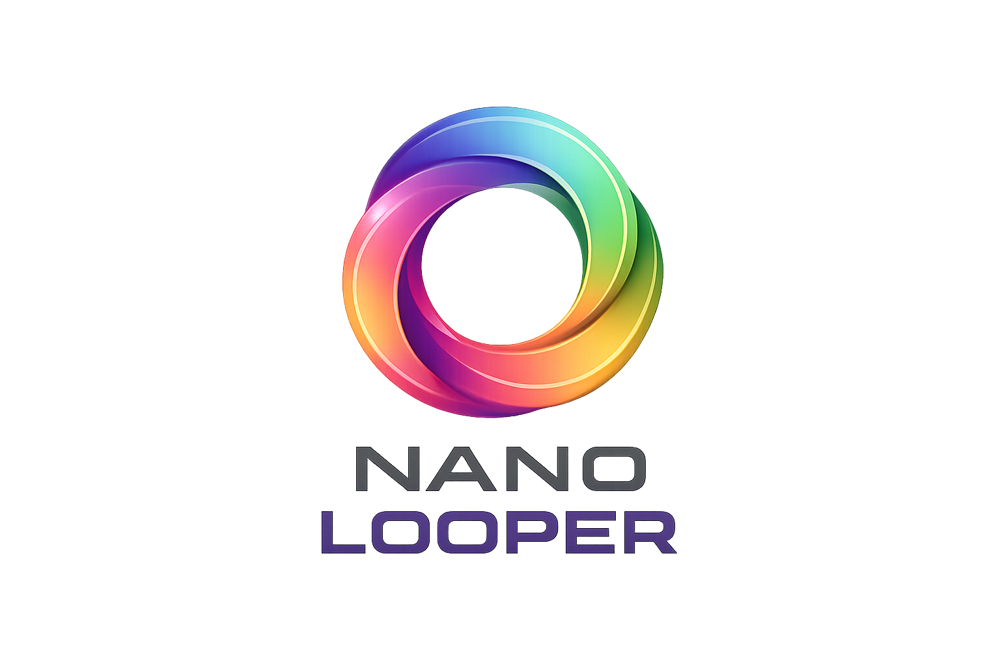

<p align="center">
  
</p>

<h1 align="center">Nano Looper</h1>

<p align="center">
  A collaborative, browser-based loop music DAW.<br/>
  Use your laptop as the audio engine. Use your phone as a controller.
</p>

---

## How It Works

1. **Create a room** on your laptop
2. **Upload audio samples** (WAV/MP3)
3. **Assign samples to pads** on a 4x4 grid
4. **Share the room link** with your phone or friends
5. **Tap pads** on any device — audio plays from the laptop

The laptop is the **audio authority** (renders all sound). Phones and tablets connect as **controllers** (trigger pads in real-time via WebSocket).

## Tech Stack

- **Runtime**: [Bun](https://bun.sh)
- **Framework**: [React Router v7](https://reactrouter.com/) with SSR
- **Styling**: [Tailwind CSS v4](https://tailwindcss.com/)
- **Database**: [Turso](https://turso.tech/) (libsql) + [Drizzle ORM](https://orm.drizzle.team/)
- **File Uploads**: [UploadThing](https://uploadthing.com/)
- **Realtime**: Bun native WebSockets

## Getting Started

```bash
# Install dependencies
npm install

# Start dev server (http://localhost:5173)
npm run dev

# Type check
npm run typecheck

# Production build
npm run build

# Serve production build
npm run start
```

## Project Structure

```
app/
├── routes/
│   ├── home.tsx          # Landing page, creates rooms
│   ├── room.tsx          # DAW/Controller UI
│   └── api/              # REST endpoints for sounds
├── lib/
│   ├── types.ts          # Core types (Room, Sound)
│   └── room.ts           # Room state utilities
└── root.tsx              # App shell

architecture/
├── dev-phases/           # Implementation milestones (01-07)
├── websocket.md          # Realtime protocol design
├── audio.md              # AudioWorklet mixer
└── ...                   # Other architecture docs
```

## License

MIT
